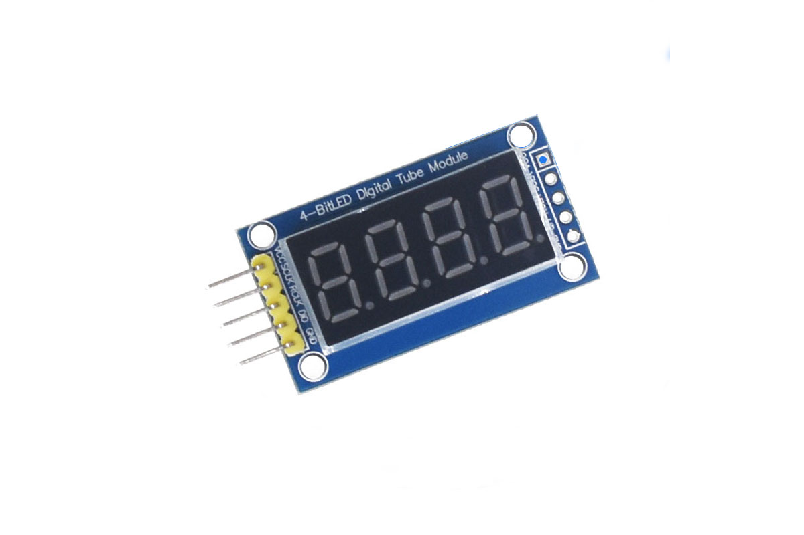
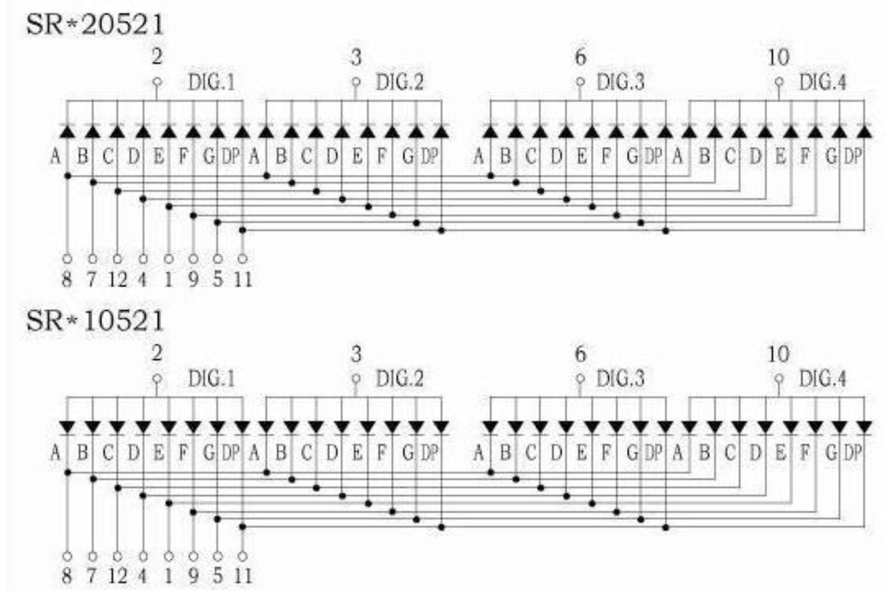
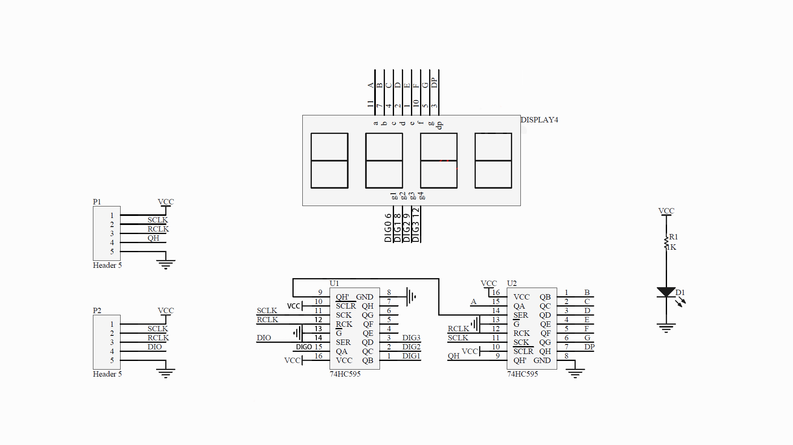
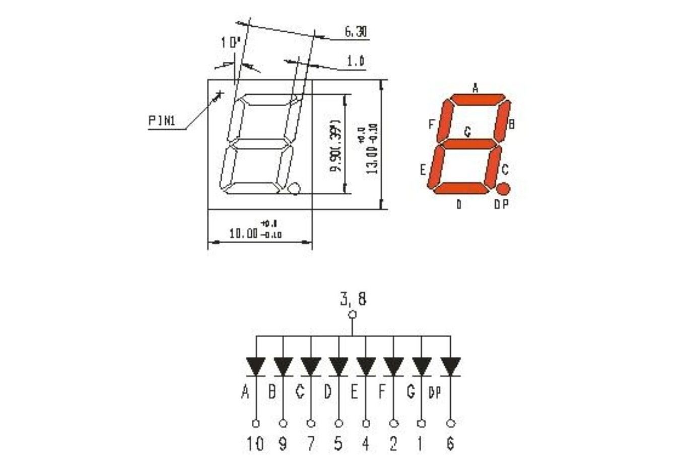
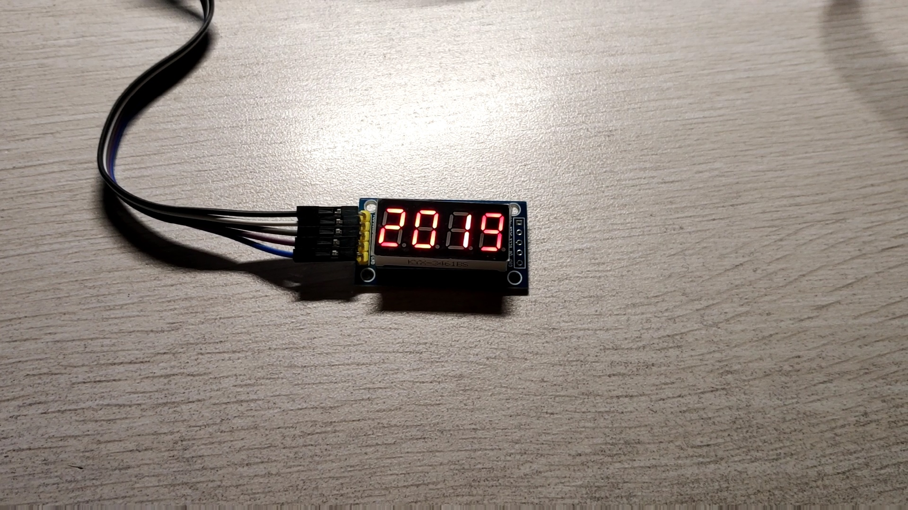
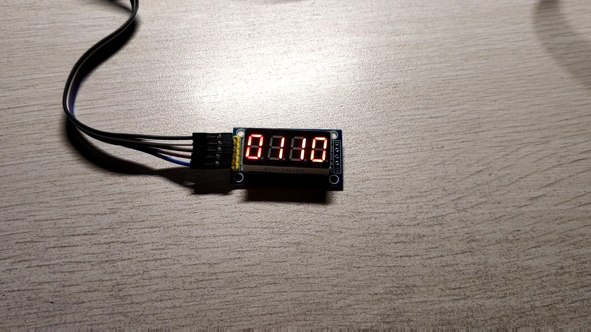
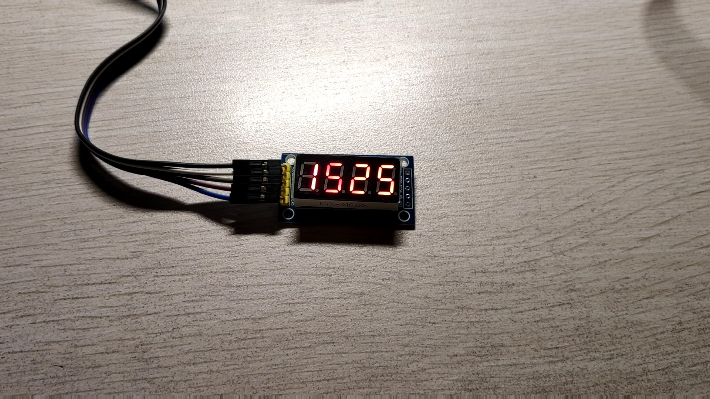

# 4-BIT-LED-Digital-Tube-Moudle

## 预备知识

如图，这是一个4位数码管模块，背面由两片74HC595控制，引脚如图，从上到下，分别为`VCC(3.3V/5V)`,`SCLK(移位控制端)`,`RCLK(输出控制端)`,`DIO(数据输入端)`,`GND(接地)`。

### 74HC595
我们来看一下74HC595是什么样的

看懂这个芯片需要一点点的数字电子技术的知识，看下面这个表格

| 符号 | 引脚 | 描述 |
| :------:| :------: | :------: |
| Q0~Q7 | 15,1~7 | 8未并行数据输出 |
| GND | 8 | 接地 |
| QA | 9 | 串行数据输出 |
| MR | 10 | 主复位(低电平) |
| SH_CP | 11 | 数据输入时钟 |
| ST_CP | 12 | 输出存储器锁存时钟线 |
| OE | 13 | 输出有效(低电平) |
| DS | 14 | 串行数据输入 |
| VCC | 16 | 3.3V/3.5V |

 - `DS(14号脚)`是数据输入端，74HC595支持8位数据并行输出，但是数据输入只有DS一个脚，需要分8次输入；
 - `OE(Out Enable)`是一个使能端，使用74HC595时需要将这个脚接地，若接高电平，那么Q0~Q7全部为0(低电平);
 - `SH_CP(Shift register ClockPin)`是一个重要的引脚，此引脚的电平从低向高变(上升沿)时，芯片从`DS`脚读入数据(0/1)；
 - `ST_CP`，集满8位数据(其实并非严格集满，Q0~Q7本来就有电平)，此引脚的上升沿将8位数据输出。

### 74HC595级联

一个74HC595可以并行输出8位数据，两个级联就可以并行输出16位数据，级联芯片时将第一片的`QA`脚接到第二片芯片的`DS`脚，`SH_CP`和`ST_CP`也同时接在一起，当第一篇芯片的`SH_CP`第九次上升沿触发时，第一片芯片的第一个数据将会通过`QA`脚输送给第二片芯片的`DS`脚。

也就是说，芯片的顺序是看`QA`和`DS`脚的顺序的。

### 电路原理图

#### 四位数码管原理图

数码管分位共阳极和共阴极，我拿到的这个数码管是共阴极，也就是说，给相应的脚设为低电平，则数码管点亮。

#### 四位数码管模块原理图

4位数码管模块使用两片74HC595级联来控制数码管，观察电路可知，第一片74HC595的低四位用来选中四位数码管，也即DIG.1,DIG.2,DIG.3,DIG.4，高四位留空不用。第二片的八位输出用来控制数码管显示的数字。

#### 数码管原理

数码管内部其实是8个发光二极管，8个二极管排列成一个“8”字，控制二极管的明灭就可以控制数码管显示的数字。下面的表给出共阳极数码管的阵脚电平和显示数字对应关系(DP不亮)

| DP GFEDCBA | 显示(十进制) | 十六进制值 |
| :------:| :------: | :------: |
| 1 1000000 |0|0xC0|
| 1 1111001 |1|0xF9|
| 1 0100100 |2|0xA4|
| 1 0110000 |3|0xB0|
| 1 0011001 |4|0x99|
| 1 0010010 |5|0x92|
| 1 0000010 |6|0x82|
| 1 1111000 |7|0xF8|
| 1 0000000 |8|0x80|
| 1 0010000 |9|0x90|

### 树莓派引脚图

通过控制树莓派的`GPIO.X`引脚电平高低即可控制外部扩展设备。
看引脚的方式是树莓派有网线接口和 USB 接口的面朝下，GPIO 阵脚的那一面面向自己，左上角位 1 号脚，右下角为 40 号脚。

## 编码实现

代码都在 [https://github.com/BDZNH/4-BIT-LED-Digital-Tube-Moudle](https://github.com/BDZNH/4-BIT-LED-Digital-Tube-Moudle)，下载之后，使用`make`命令编译，使用`sudo ./showtime	`执行。

### 接线

| 四位数码管模块 | Raspeberry |
| :-----: | :-----: |
| VCC | 1 号脚(可改变) |
| GND | 9 号脚(可改变) |
| DIO | 12 号脚 |
| SCLK | 13 号脚 |
| RCLK | 15 号脚 |

## 演示

循环显示年份，日期，时间，只显示到分钟，不显示秒。

## 参考

[1] 74HC595的讲解，很详细，推荐观看[https://www.bilibili.com/video/av10007630/?p=14](https://www.bilibili.com/video/av10007630/?p=14)

[2] wiringPi 库的解说，也很详细，推荐收藏[https://www.cnblogs.com/lulipro/p/5992172.html](https://www.cnblogs.com/lulipro/p/5992172.html)